# 社团管理系统 / Community Management System


> 更多毕设项目可跳转至项目导航栏检索：[毕设项目](http://sysadmin.3vfree.vip)，需要联系博主v：xq-lucky311，q：1047944234. 备注：项目咨询注：由于前端项目太大，仅上传了后端代码，未包含前端代码...

## 项目简介  
基于 SpringBoot + MyBatis-Plus + Shiro 的 B/S 架构社团管理系统，包含管理员、社长和用户三级权限体系，实现社团创建审核、活动报名、经费审批等核心功能，采用 MySQL 数据库保障数据安全。

## 特征介绍  
- **权限控制**：集成 Apache Shiro 实现动态权限管理，支持管理员/社长/用户三级角色隔离。  
- **高效开发**：MyBatis-Plus 自动生成 CRUD 操作，减少 80% SQL 编写量。  
- **文件管理**：内置 FileUtil 工具类支持多格式文件上传，存储路径动态配置。  
- **数据安全**：MD5 加密存储敏感信息，拦截器实现请求鉴权过滤。  
- **多源适配**：支持 MySQL/MSSQL 双数据库驱动，配置文件一键切换。  

## 代码结构 
```
src/
├── main/
│   ├── java/
│   │   ├── com/
│   │   │   ├── SpringbootSchemaApplication.java          # 启动类
│   │   │   ├── annotation/                              # 权限注解
│   │   │   │   ├── LoginUser.java
│   │   │   ├── config/                                  # 全局配置
│   │   │   │   ├── MybatisPlusConfig.java
│   │   │   ├── controller/                              # 接口层
│   │   │   │   ├── FileController.java
│   │   │   ├── dao/                                     # 数据访问层
│   │   │   │   ├── HuodongbaomingDao.java
│   │   │   ├── entity/                                  # 数据模型
│   │   │   │   ├── HuodongbaomingEntity.java
│   │   │   │   ├── model/                               # 业务模型
│   │   │   │   ├── view/                                # 视图对象
│   │   │   ├── interceptor/                             # 请求拦截器
│   │   │   │   ├── AuthorizationInterceptor.java
│   │   │   ├── service/                                 # 服务层
│   │   │   │   ├── impl/                                # 服务实现
│   │   │   ├── utils/                                   # 工具类
│   │   │   │   ├── MD5Util.java
│   ├── resources/
│   │   ├── application.yml                              # 主配置
│   │   ├── mapper/                                      # MyBatis映射文件
│   │   │   ├── HuodongbaomingDao.xml
```
## 使用说明
1. 数据库配置：修改 `application.yml` 中 MySQL 连接参数
```yaml
url: jdbc:mysql://localhost:3306/springbooteuw84
username: root
password: 123456
```

2. 访问入口：
后台管理：http://localhost:8080/springbooteuw84/admin/dist/index.html
管理员账号：abo/abo
用户前台：http://localhost:8080/springbooteuw84/front/index.html

3. 开发工具：推荐使用 Chrome 浏览器
```

# 项目实际截图：

## 前台：
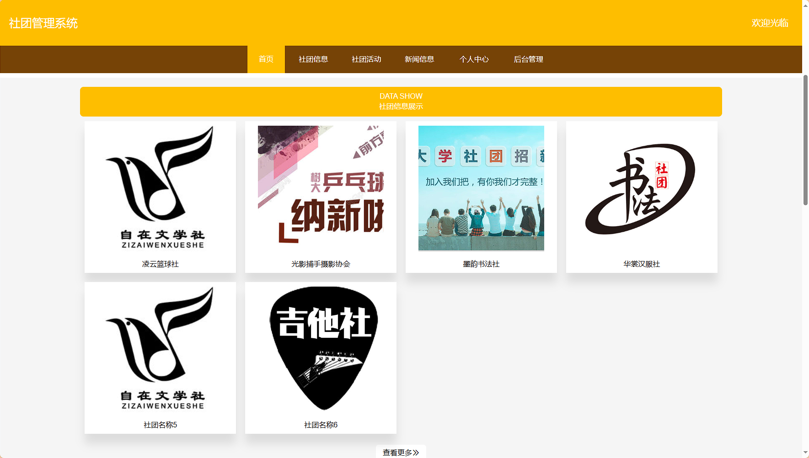
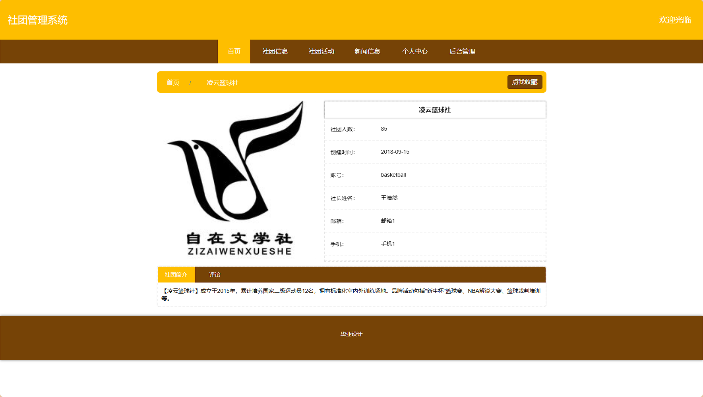
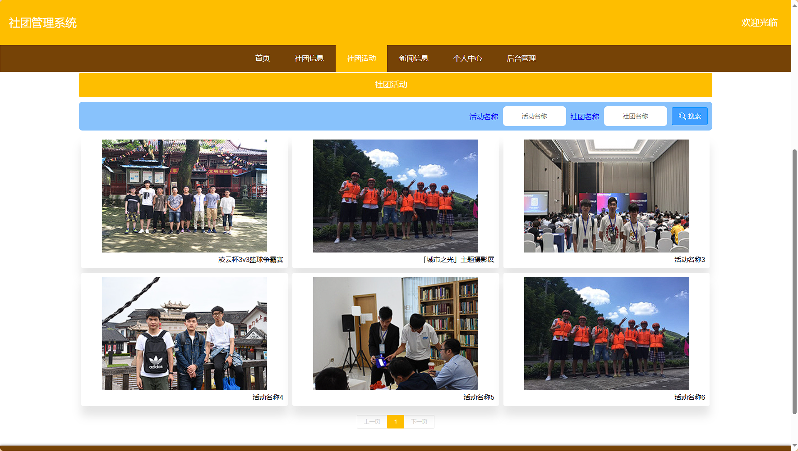
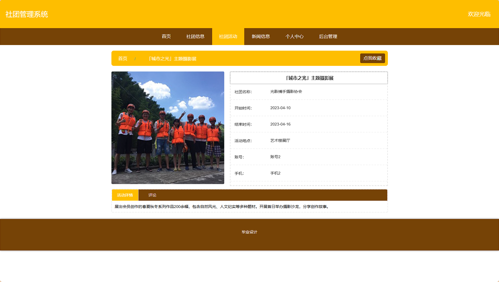


## 后台：
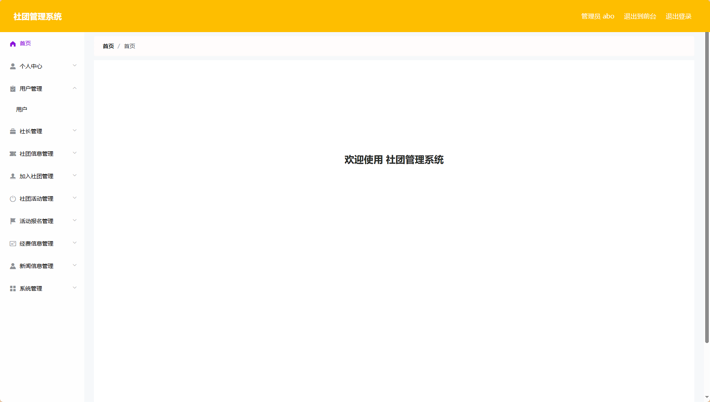
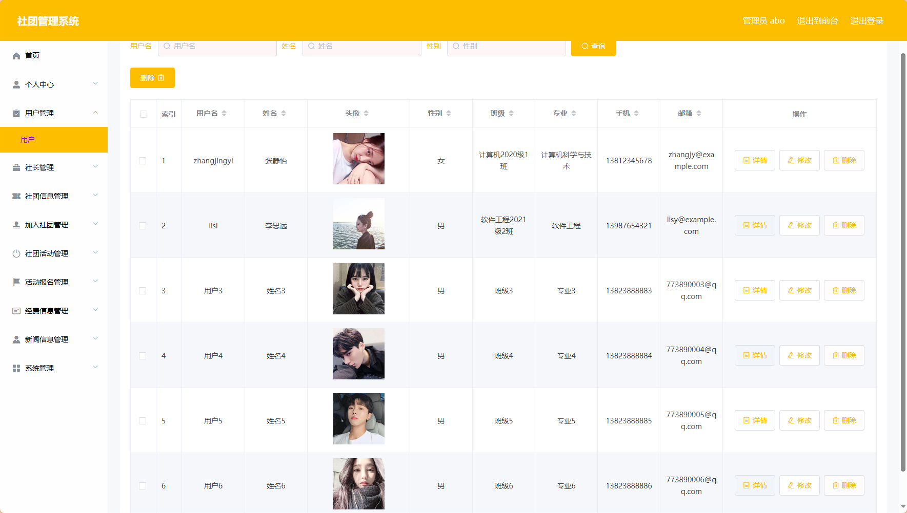
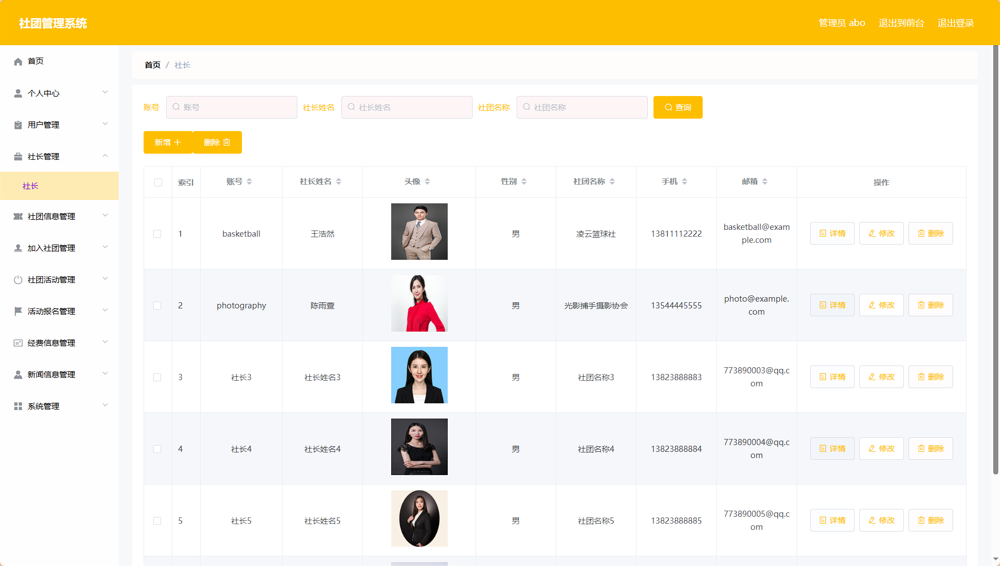
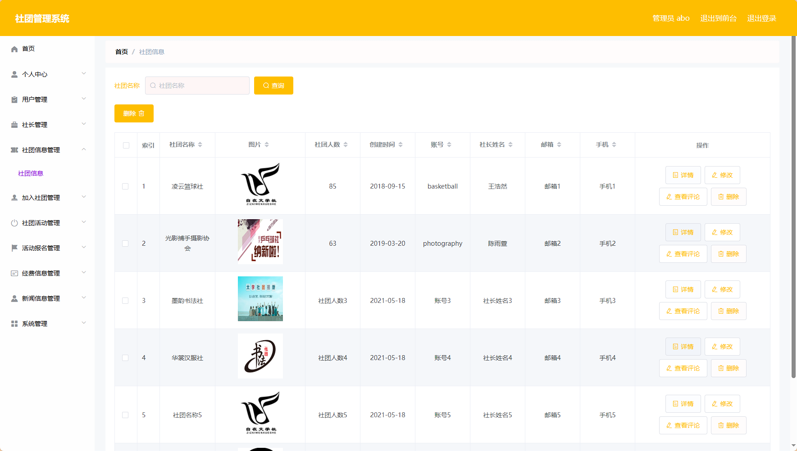
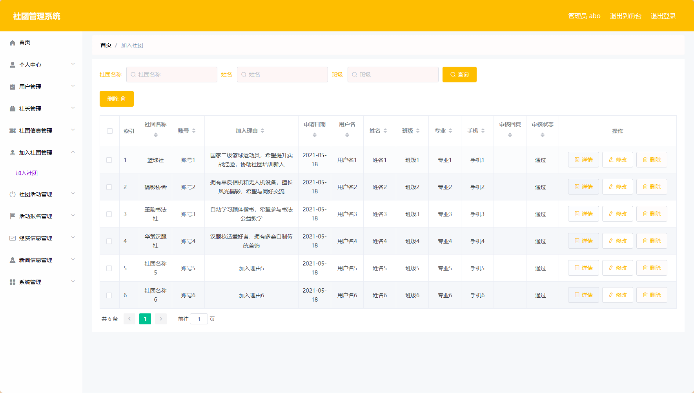
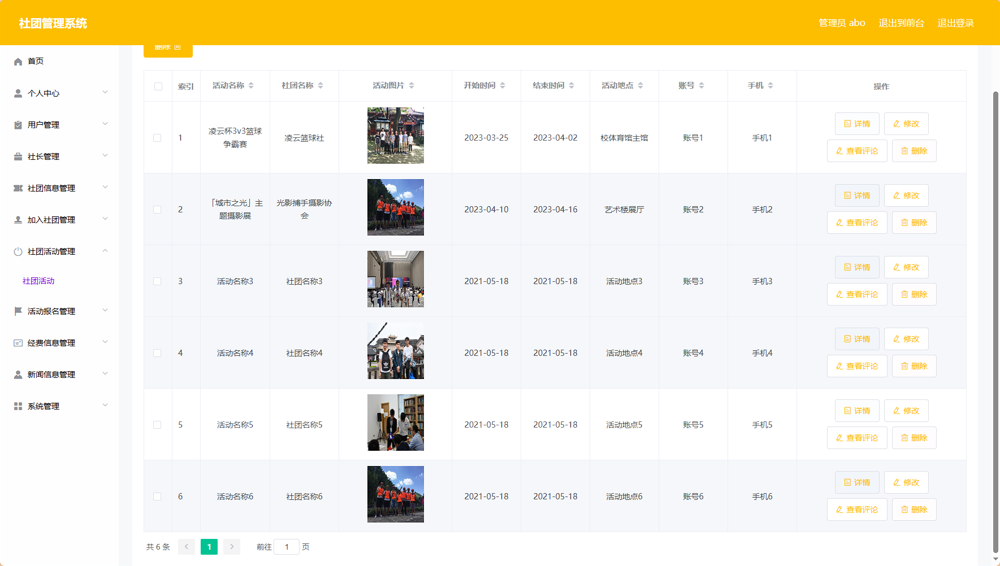
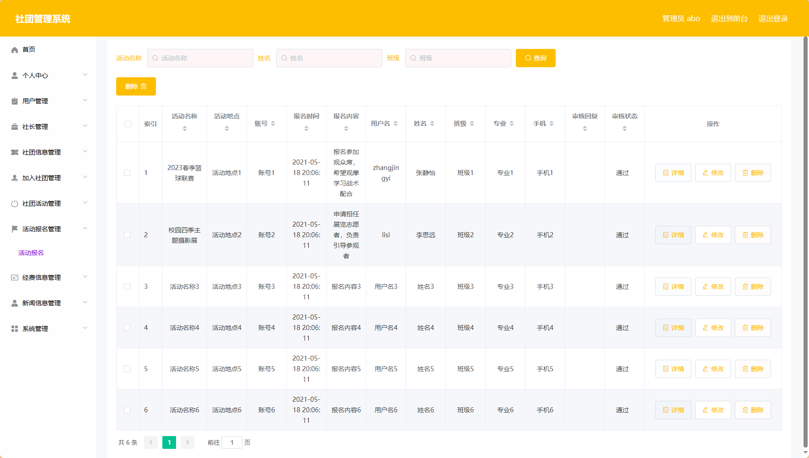
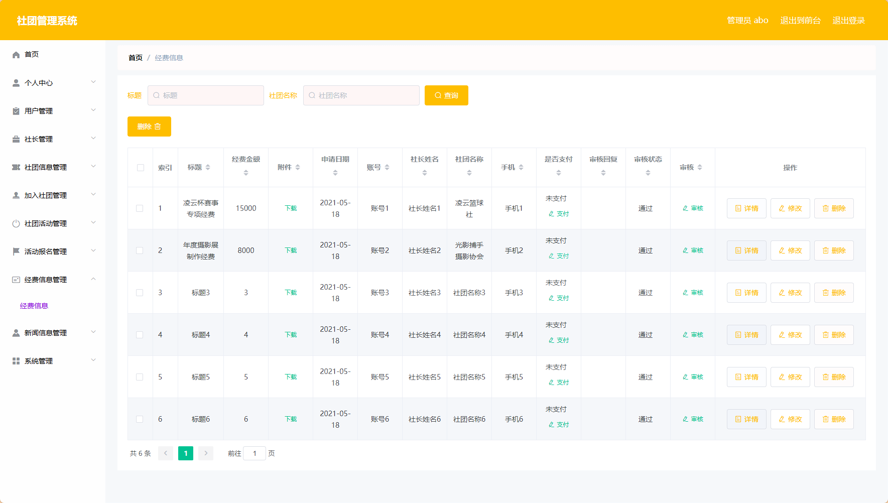
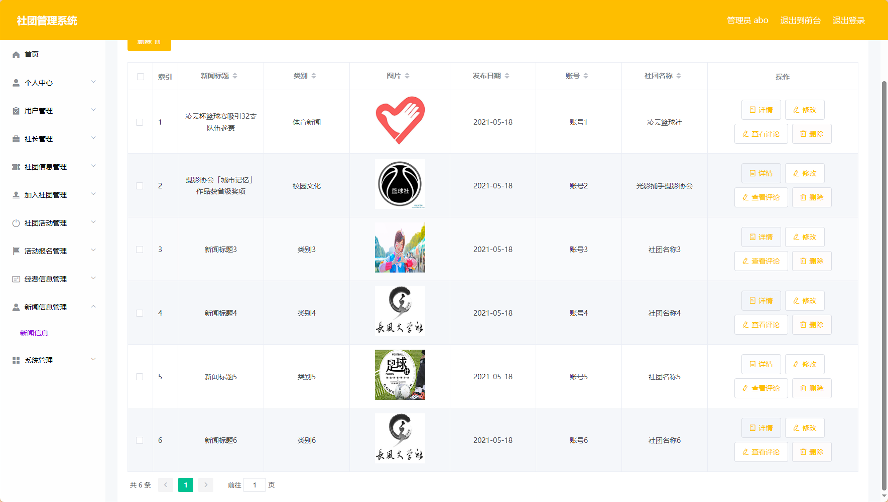

> 等等...

# 精选项目导航 & 快速部署工具
## 项目资源一站直达
- ​**访问项目导航站**：[点击进入](http://sysadmin.3vfree.vip)**快速检索所需项目名称**
- ​**技术栈全覆盖**：Java/SSm/Spring Boot/小程序等主流技术方案
- ​**配套资源**：每个项目均提供部署文档 + 演示视频（附效果截图）

### ▌导航站预览


### ▌工具界面预览


## 捐赠
> 博主将持续更新Java全栈开发项目，包含ssm，springboot，前后端分离系统等项目。
> 此外如果您够宽裕，请博主喝杯咖啡吧！捐赠将用于服务器维护与开源社区建设，感谢您的认可！
> 如需更多Java相关项目毕设3000+，有其他项目需求，sql文件等可联系博主v:xq-lucky311

---